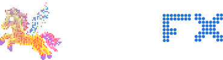

  
   
  
<strong>Professional cross-platform desktop application (Windows, macOS, Linux) and web studio for LED matrix & Lite Peg animation, pixel art, and hardware firmware generation.</strong>

  

    
  

---

## English

### Overview
PegFX is a professional cross-platform design and animation studio for creators, hardware hackers, and embedded engineers building interactive RGB LED matrix and Lite Peg projects. Available as a high-performance native desktop application for Windows, macOS, and Linux (featuring direct disk saving and live USB hardware streaming) and as a zero-install web app. It provides an infinite virtual stage layer coordinate system, multi-layer compositing stack with luminance fading, Z-ordering, mathematical blend modes, offscreen transit wrapping, in-betweens (tweening) motion generator, multi-frame timeline with second markers, custom reusable stamps, multi-size dot-matrix typography generator, and real export engines for microcontrollers.

### Key Features
- **Board Grid Topologies**:
  - **⊞ Square Grid**: Standard orthogonal Cartesian grid (rows and columns align in a tic-tac-toe grid).
  - **፨ Peg Lite Grid**: Authentic alternating staggered grid (odd rows shifted by half a peg pitch for classic triangular/hexagonal honeycomb peg layout).
- **Curated Color Palettes**:
  - **💡 Retro Lite Pegs (8-Color Classic)**: Red (`#E8283C`), Orange (`#FF8C1A`), Yellow (`#FFE135`), Green (`#3DB54A`), Blue (`#1E6FD9`), Pink (`#FF6FA5`), Violet (`#8E44C9`), Clear/White (`#F5F5F0`).
  - **✨ Modern Lite Pegs (6-Color Standard)**: Orange (`#FF8C1A`), Yellow (`#FFE135`), Green (`#3DB54A`), Blue (`#1E6FD9`), Pink (`#FF6FA5`), Clear/White (`#F5F5F0`).
  - **Thematic Packs**: NYC MTA Subway, Cyberpunk 2069, Ghibli Muted, 8-Bit Arcade, Amber CRT, Matrix Green, and Custom Palettes.
- **Hardware Diode Simulation**: 64x32 (Adafruit MatrixPortal standard), 16x16, 32x16, 32x32, 64x64, 128x64, and custom resolutions with round diode physical masks, square pixel modes, realistic 2px black PCB gaps, and diode bloom glow.
- **Physical Off-State Guarantee (`INV-006`)**: Unlit LEDs (styled as subtle `#111111` in browser dark mode) export to pure `0x0000` (RGB: `0, 0, 0`) on all microcontrollers (ESP32, Raspberry Pi, MatrixPortal) for 0mA dark state.
- **Isometric 3D Layer Stack View**:
  - Interactive 3D Exploded Perspective View modal (`🧊 3D Stack`) located right in the Canvas Viewport Top Status Bar.
  - Visualizes multi-layer Z-ordering with customizable layer spacing (`20px` to `120px`), live animation playback, and free mouse drag 3D rotation.
- **Project Lifecycle, Safety & Deep History Engine**:
  - **New Project Wizard (`📄 New`)**: Dedicated creation dialog for configuring matrix layouts (64x32, 32x16, 32x32, 64x64, 128x64, 16x16, custom), project modes (Static 1-Frame vs Animation Reel with initial frame count and FPS inputs), and safety warnings with **$256 \times 256$ canvas dimension clamping** and an explicit unclamp toggle with browser performance notices for power users.
  - **Accidental Wipe Protection**: Switching matrix presets when the board is dirty prompts for explicit confirmation, preventing accidental loss of artwork.
  - **Deep History Undo / Redo (`Ctrl+Z` / `Ctrl+Y`)**: Complete project snapshot architecture that reliably restores deleted/added layers, deleted/added frames, transform offsets, and drawing strokes.
- **Non-Destructive Adjustment Layers (`+ ⚡ FX`)**:
  - **Live Mathematical Filter Stack**: Apply non-destructive color transformations across the composite Z-stack without altering original sprite pixel art.
  - **Smart Auto-Naming**: Automatically updates layer names (e.g. `⚡ Hue/Saturation 1`) when switching effect types while preserving custom user-assigned names.
  - **6 Dynamic Effect Modes**:
    - ☀️ `Brightness & Contrast`: Real-time contrast curve and brightness adjustments ($\pm 100\%$).
    - 🌈 `Hue & Saturation`: RGB $\leftrightarrow$ HSL rotation ($-180^\circ$ to $+180^\circ$), saturation booster ($\pm 100\%$), and lightness control ($\pm 100\%$).
    - 🎨 `Color Tint & Blend`: Custom tint colors with intensity slider and blend modes (*Tint/Lerp*, *Multiply/Darken*, *Screen/Glow*, *Overlay/Contrast*).
    - 🔄 `Invert Colors`: Inverts RGB channels of all lit diodes.
    - 📊 `Posterize / Levels`: Color quantization ($2$ to $16$ discrete color levels).
    - 🎭 `Theme Palette Remap`: Live Euclidean distance snapping to the active theme palette.
  - **Configurable Scope (`🌐 All Below` vs `↳ Next Only`)**: Toggle whether the adjustment filter transforms all accumulated layers beneath it or acts as a clipping mask affecting only the layer directly below (with stacked additive FX chaining).
  - **Timeline Synchronization & Keyframing**:
    - `🎞️ All Frames`: Adjustments apply uniformly across the entire animation reel.
    - `🎯 Keyframe Only`: Keyframe adjustment parameters per-frame to animate day-to-night lighting transitions and color shifts.
  - **Animated In-Betweens (Tweening)**: Automatically calculates intermediate color shifts and filters across timeline keyframes.
  - **Precision Steppers & Direct Numeric Inputs**: Every slider features clickable `−` / `+` step buttons and direct numeric textboxes for fine-tuning.
- **Non-Destructive Gradient FX Layers (`+ 🌈 Grad`)**:
  - **Procedural Gradient Fill Engine**: Add vibrant, non-destructive gradient layers to your artwork without overwriting underlying pixel art.
  - **Multiple Gradient Topologies**:
    - `Linear`: Angle-directed linear gradients with interactive slider ($0^\circ$ to $360^\circ$) and quick preset buttons ($0^\circ$, $45^\circ$, $90^\circ$, $135^\circ$, $180^\circ$).
    - `Radial`: Radial bloom expanding outward from the center of the display.
    - `4-Corner Mesh (`mesh4`)`: Bilinear color mesh interpolation across 4 independently customizable corner colors (Top-Left, Top-Right, Bottom-Left, Bottom-Right).
  - **Ordered Bayer $4 \times 4$ Dithering**: Eliminates harsh color stepping and banding on low-resolution LED matrix hardware (e.g. 64×32, 32×32) using cross-pattern spatial dithering.
  - **Blend Modes & Opacity**: Supports `Replace LED (Overwrite)`, `Merge LED (Alpha Blend)`, `Multiply`, `Screen`, and `Overlay`, with full opacity control ($0\%$ to $100\%$).
  - **Hardware Export Ready**: Composites seamlessly through `getCompositeGrid()` for full compatibility with Arduino RGB565 C++ arrays, CircuitPython indexed BMPs, and SVG vector exports.
- **Canned Looped Environment Animations (`✨ FX Studio` / `+ ✨ Env`)**:
  - **Hybrid "Preview & Bake to Layer" Architecture**: Preview procedural looped atmosphere effects live over your artwork and bake them into dedicated animation layer keyframes in one click.
  - **7 Procedural Environment Effects**:
    - 🌧️ `Rain Storm`: Angled streaks with randomized droplet speeds, periodic toroidal wrapping, and splash diodes.
    - ❄️ `Snowfall`: Gentle drifting snowflakes with sine-wave wind wobble and realistic multi-speed depth.
    - 🎆 `Fireworks & Sparks`: Spectacular rising rocket trails and bursting radial star bursts with gravity decay.
    - ❇️ `Fairy Twinkle`: True 2D randomized star scatter across the matrix grid with min/max brightness boundaries, re-rollable scatter assortment seed, dual-color blending, and peak glistening highlights (stackable via Screen mode for multicolor constellations).
    - 🔥 `Campfire Embers`: Rising fiery sparks with upward convection drift and heat-based cooling colors.
    - 💻 `Matrix Digital Rain`: Retro cyberpunk falling green glyph code streams with bright white leader diodes and trailing phosphors.
    - ✨ `Starfield & Twinkle`: Deep space cosmos with twinkling stars and multi-plane parallax depth.
  - **Universal Bipolar FX Speed & Freeze Controls**: Velocity slider spanning $-4$ to $+4$ with live state badges: positive values animate forward, $0$ freezes particles in place, and negative values animate in reverse (e.g. rain/snow falling upward, embers sinking, code streams scrolling up).
  - **Expanded Layer Blend Modes**: Supports `Replace LED`, `Merge LED (50/50)`, `Screen (Glow / FX)`, `Multiply (Shadow)`, and `Overlay (Contrast)` with true luminance fading on standalone pixels and black backgrounds.
  - **Environment Layer Scope & Multi-Frame Sync**:
    - **Layer Scope**: Toggle between `🌐 All Below` and `↳ Next Layer Only` (masks environment particles strictly to coordinates painted on the layer beneath).
    - **Timeline Sync**: Defaults to `🎞️ All Frames` so visibility and luminance opacity adjustments automatically apply across all project frames.
  - **Ultra-Fast Playback Engine**: In-place DOM recycling and lightweight thumbnail tracking for smooth, stutter-free 60 FPS playback on complex multi-layer animations.
  - **100% Microcontroller Compatibility**: Bakes procedural effects directly into project frames as dedicated layer keyframes (`❄️ Snow FX`, `🌧️ Rain FX`, etc.) so embedded displays run them at full speed with 0 CPU overhead.
- **3D Multi-Layer Studio (`🧊 3D Stack`)**:
  - **Spacious 640px+ Viewport & Headroom**: Large expanded modal stage (`min-h-[640px]`, `h-[72vh]`, `max-h-[880px]`) ensuring full canvas visibility at extreme viewing angles.
  - **Interactive Mouse Wheel & Slider Zoom**: Smooth zoom scaling (30% to 220%) with mouse wheel scrolling.
  - **Dual Camera Projections**: Seamlessly switch between **`📐 True Isometric`** (parallel orthographic projection, no foreshortening, canonical $54.736^\circ / -45^\circ$ angles) and **`🎥 3D Perspective`** (realistic depth vanishing point).
  - **Retina / HD Diode Renderer**: Anti-aliased high-resolution physical LED diode simulation with dark bezels, glowing diode cores, and realistic specular highlights.
  - **Holographic FX Planes & Title Badges Toggle**: Floating translucent adjustment planes with optional title badges (`🏷️ FX Badges`).
  - **Hidden Layers Visibility Modes**: Toggle between **`👻 Ghost (20% Faded)`** and **`🚫 Invisible (100% Hidden)`** to completely remove hidden layers from the 3D stack.
  - **Interactive 3D Layer Tag Cloud**: Instant layer visibility toggling (`👁` / `🚫`) and active layer switching directly within 3D.
  - **3D High-Res Snapshot Exporter (`📸 Snapshot`)**: Instant export of the current 3D perspective or isometric view at crisp 1920×1080 resolution on a studio dark gradient background.
  - **3D Video & Animated GIF Recorder (`🎥 Record 3D`)**:
    - **`🎞️ Sequence Reel`**: Renders the complete animation in 3D exploded view.
    - **`🔄 360° Turntable Spin`**: Automatically records a smooth 360-degree rotating showcase video or GIF.
    - **Dual Format Support**: Exports to **WebM HD Video (`.webm`)** and **Animated GIF (`.gif`)** with customizable "Export as Looped" toggle.
- **Infinite Virtual Stage & Multi-Layer Studio**:
  - Independent composited layers per frame (`Layer 1`, `Layer 2`, etc.).
  - **Live "EDITING: [LAYER NAME]" Status Header**: Bold active layer status indicator above the matrix viewport.
  - **Layer Lock (`🔒`)**: Locks layer from accidental edits. Drawing attempts trigger a glowing red viewport border pulse and a non-intrusive soft toast alert (`Layer Is Locked`).
  - **Layer Solo (`👑`)**: Isolates the active layer for detailed editing by dimming non-soloed layers to 15% opacity.
  - **Insert Above Active Layer**: Creating a new layer automatically positions it directly above the currently active layer across all frames.
  - **Z-Order Reordering**: HTML5 drag-and-drop handles (`☰`) and `▲` / `▼` buttons to reorder layer stacking priority across the entire project.
  - **Local Layer Coordinate Space**: Sprites are preserved as unified intact objects. The matrix viewport looks into the stage space, allowing `xOffset` and `yOffset` to slide seamlessly into negative (`-128`) and positive (`+128`) offscreen space.
  - **3x3 Virtual Stage Space Mini-Map**: Displays layer offset beacons and quad click navigation to center or offset sprites across a 3x3 virtual arena.
  - **Direct Active Layer Drawing**: Drawing and erasing tools write directly to the selected layer in local space; upper layers never swallow or obscure clicks.
  - **Double-Click Inline Rename**: Double-click any layer name in the stack or click `✏` to edit its title with `Enter` / auto-commit.
  - **Luminance / Fade Slider with Precision Stepper (0%–100%)**: Real-time layer brightness/opacity fading with `−` / `+` buttons and direct numeric entry.
  - **Layer Blend Modes**:
    - `Replace LED (Overwrite)`: Top-most lit LED wins and takes over the diode.
    - `Merge LED (Mathematical Blend)`: Color channels are blended mathematically `((R1 + R2)/2, (G1 + G2)/2, (B1 + B2)/2)` with alpha weighting.
  - **Layer Wrap Modes**:
    - `Continuous Wrap`: Instant toroidal wrap-around at matrix boundary.
    - `Clear then Wrap (Offscreen Transit)`: Active LEDs scroll completely off-screen into virtual space before wrapping back in from the opposite side.
- **In-Betweens & Timeline Animation Studio**:
  - Automated interpolation of layer motion/position `(X, Y)` and luminance fading `(Opacity)`.
  - **Keyframed Diode Color Interpolation**: Interpolates RGB diode transitions (e.g. Dawn to Day, Dusk to Night, and smooth color morphing).
  - **Multi-Frame Insertion (`+ Insert Frame(s)`)**: Numeric multiplier (1–1000) that inserts cloned frames immediately after the currently selected frame.
  - **Looping Animation Helper (`🔁 Copy 1st to Last`)**: One-click helper that duplicates Frame 1 as the final frame of the animation with a safety confirmation prompt.
  - **Timeline Reel with Second Markers**: Exact second markers (`0.00s`, `0.12s`, `0.25s`...) under every frame thumbnail dynamically calculated as `(FrameIndex / FPS)`.
- **Expandable Accordion Tools Sidebar**:
  - Left sidebar organized into 5 collapsible categories: Colors & Swatches, Tools & Shapes, Typography, Selection & Stamps, and Layers Stack.
  - `[x] Auto-expand on hover` option for instant mouseover workflow.
- **Dynamic Viewport Resizing (High-Res & 4K Displays)**:
  - Drag handle (`◢`) in the lower-right corner to expand or contract the canvas viewport and edit window.
  - Reset Window button (`↺`) in the upper-left corner of the status bar to instantly restore default sizing.
  - Automatically adapts LED diode sizing to fill expanded screens with `localStorage` persistence.
- **One-Shot Eyedropper Sampling Tool (`🧪 Pick` / `I`)**: Quick sampling of any LED dot color from the canvas that automatically reverts to your previous drawing tool upon click.
- **Interactive Live Shape Previews**: Real-time rubberband ghost outlines while dragging Line, Rectangle, and Circle tools.
- **Marquee Selection & Stamps Shelf**:
  - Drag with Select tool (`S`) or paste clipboard copies.
  - Selection controls relocated directly inside the Stamps Shelf panel for immediate reuse.
- **Typography Engine & International Pixel Fonts**:
  - Multi-size bitmap LED fonts: 3x5 Mini, 4x6 Standard, 5x7 Classic LED, and 7x9 Bold Transit (with full ASCII Latin and Cyrillic support).
  - **International Pixel Fonts (CJK & Cyrillic)**: 🇯🇵/🇨🇳 `DotGothic16` & `DotGothic18` (Japanese Kanji/Hiragana/Katakana & Chinese), 👾 `Press Start 2P` (Cyrillic & Latin), 📟 `VT323` (CRT Terminal), and 🔲 `Silkscreen`.
  - **Compact Typography Selector & Dynamic Metadata**: Shortened font names eliminate horizontal scrolling in the sidebar; includes native hover tooltips with dimension/character specs and live `#font-meta-badge` status descriptions on change.
  - Single-glyph international unicode rasterizer with common baseline anchoring and binarization thresholding (`lum >= 50`) keeping character loops (`s`, `e`, `a`, `8`) sharp and open.
  - **Text Flow & Direction Modes**:
    - `Horizontal (LTR →)`: Standard horizontal flow.
    - `Vertical Stacked (↓ Upright / 縦書き)`: Upright glyph stacking for Japanese Tategaki and column signs.
    - `Vertical Rotated 90° CW (↻)`: 90° Clockwise rotated text.
    - `Vertical Rotated 90° CCW (↺)`: 90° Counter-Clockwise rotated text.
  - **Unbounded Virtual Stage Text Layers**: Complete text strings of any length are preserved across infinite stage width/height without boundary clipping (`wrapMode: 'clear_then_wrap'`), ready for live scrolling marquee tickers and tween animations.
  - **Interactive Pixel Kerning (`−` / `+`)**: Dynamically adjust letter tracking from `0px` (tight) to `16px` (spaced).
  - **Non-Destructive Text Layers**: Automatically centers text onto a dedicated new layer.
  - Dedicated font color picker and customizable **1px or 2px outline borders** with dark diode masking.
- **Pro Image & Sprite Importer Studio (`🖼️ Import`)**:
  - **Universal Image Decoders**: Import PNG, JPG, WebP, GIF, SVG, and BMP files directly from your device or clipboard.
  - **Automatic Downsampling**: Bring in arbitrary high-res images (including 10x pixel-art renders like 640x320, 160x160 icons, or full-size photos) with automatic downscaling to the matrix resolution.
  - **Aspect Ratio & Framing Modes**:
    - `Contain (Fit)`: Proportional fit with auto-centering and letterboxing.
    - `Cover (Fill)`: Proportional fill with center-cropping.
    - `Stretch`: Direct aspect-ratio stretch.
    - `1:1 Centered`: 1-to-1 unscaled pixel coordinate matching.
  - **Downsampling Algorithms**:
    - `Pixel Art (Nearest-Neighbor Crisp)`: Preserves sharp edges without blurry color blending for pixel art and retro sprites.
    - `Photo (Smooth Bilinear)`: High-quality interpolation for photos, logos, and gradients.
  - **Color & Diode Enhancements**:
    - `True RGB`: 24-bit RGB mapped to hardware 16-bit RGB565.
    - `Snap to Active Theme Palette`: Real-time Euclidean distance color quantization to match the current theme palette.
    - `Monochrome`: High-contrast black & white thresholding.
    - `Brightness (-100 to +100)` & `Contrast (-100 to +100)` sliders.
    - `Dark Background Cutoff (0 to 80)`: Automatically converts dark/black backgrounds into physical off-state unlit LEDs (`0x0000`).
  - **Destination Flexibility**: Import directly to a **New Dedicated Layer** (non-destructive), overwrite the **Active Layer**, or save as a reusable **Stamp** in the Stamps Shelf.
  - **Live Split-Screen Diode Preview**: Real-time simulated LED matrix preview canvas with physical diode masks and bloom before committing.
- **Canvas-First Responsive Mobile & Tablet Interface (< 1024px)**:
  - **Fixed Bottom 5-Tab Rail**: Thumb-friendly bottom navigation bar (`✏️ Draw`, `🎨 Color`, `📑 Layers`, `💾 Stamps`, `🔤 Type`) with dynamic active color dot and active tool badge.
  - **Slide-Up Bottom Sheet**: Smooth slide-up sheet over the lower viewport for immediate tool/color tweaks; tapping the active tab again, clicking `✕`, or tapping the backdrop cleanly collapses it.
  - **Slim Mobile Top Header**: Compact diode resolution/zoom stats, active layer indicator chip, and right-hand Hamburger Menu (`☰`).
  - **Right-Hand Studio Drawer**: Comprehensive slide-over menu for New Project, Image Import, 3D Multi-Layer Studio, Tweening Motion, Firebase Cloud, and Hardware Exporters.
  - **Animated Brand Entry Toast**: Non-intrusive `⚡ PegFX` welcoming toast on mobile load.
  - **Touchscreen Drawing**: Single-finger continuous diode drawing with `touch-action: none` to prevent page jitter/scrolling.
  - **Zero Desktop Regression**: Desktop viewports ($\ge 1024\text{px}$) retain full accordion sidebars and wide toolbars.
- **UIVerse.io "Lumen Edge" Design System**:
  - Unified aesthetic with deep void canvas background (`#1b1c22`), subtle hairline borders (`#2f3441`), horizon ambient highlights, and elevated panel surfaces.
  - Dedicated `#4777ab` steel-blue visual identity for FX adjustment layers (`⚡ FX` badges, steel-blue glows, and 3D filter planes).
- **Modular Zero-Dependency Architecture**:
  - Clean modular architecture (`css/`, `js/fonts.js`, `js/state.js`, `js/layers.js`, `js/matrix.js`, `js/drawing.js`, `js/typography.js`, `js/timeline.js`, `js/exporters.js`, `js/importer.js`, `js/cloud.js`, `js/app.js`).
  - Zero build steps or node server dependencies required; runs 100% statically in any modern browser.
- **Hardware & Vector Export Pipelines**:
  - **Scalable Vector Graphics (SVG)**: 5 selectable vector export presets:
    - 💡 **Refractive Brite Pegs**: Photorealistic acrylic peg lenses utilizing grayscale refractive geometry with `mix-blend-mode: color` blending and authentic unlit pegboard sockets.
    - ✨ **Emissive Glow Dots**: Round LED diodes with soft Gaussian bloom filters and specular bulb caps.
    - ⚪ **Clean Round Dots**: Flat minimal solid circles ideal for laser cutters, vinyl cutters, Cricut, and pen plotters.
    - ⊞ **Square Grid Matrix**: Hardware-accurate square pixel simulation with 1px dark hairline PCB gaps.
    - ⬛ **Seamless Pixel Art**: 1:1 gapless crisp vector rectangles for game engines and sprite sheets.
  - **CircuitPython**: Generates single-frame or animated `code.py` boilerplate + downloads binary indexed `.bmp` files for Adafruit MatrixPortal.
  - **Arduino C / C++**: Generates `const uint16_t PROGMEM` single or multi-frame animation 3D array header files with 16-bit RGB565 encoding for `Adafruit_Protomatter` / `FastLED`.
  - **Lottie Vector JSON (.json)**: Exports crisp vector animations for Web, iOS, and Android applications.
  - **BMP Exports**: Dedicated 8-bit Indexed BMP and 24-bit TrueColor RGB BMP downloads.
  - **Images & Visuals**: Animated GIF, 1:1 sprite PNG, and rendered high-res simulated LED beauty PNGs.
  - **Project Blueprint**: Download & load `.json` multi-frame blueprints or import existing images.
- **Dual Storage Strategy with Palette Packing & GZIP Cloud Compression**:
  - *Offline / Local*: Auto-saves to browser `localStorage`. No login or network required.
  - *Firebase Cloud (`ledout-19d28`)*: Google Sign-In with circular avatar display, compact palette serialization, GZIP payload compression, and most-recent-first blueprint sorting.
  - **Cloud Blueprint Same-Name Versioning (`v1`, `v2`...)**: Automatically checks for title collisions in Firestore and saves as incremented versions `v(N+1)` of existing blueprints without creating duplicate files, with a dedicated "Save as Copy" button.
  - **Single File Export (`⬇️ File`)**: Download any cloud blueprint directly as a `.json` file from the library.
  - **Bulk Backup & Import (`📦 Export All` / `⬆️ Import`)**: One-click download of all cloud blueprints into a unified backup `.json`, and direct bulk import.
- **Group Layers System (`+ 📁 Group`)**:
  - **Folder Organization & Folding**: Clean hierarchy with folder headers, collapse/expand toggle (`▼` / `▶`), and nested member indentation with tree lines (`↳`).
  - **Isolated Group Compositing**: Layers inside a group composite into an isolated sub-buffer.
  - **Scoped FX Clipping**: An Adjustment FX layer placed directly above (or inside) a group filters only that group's contents and stops at the end of the group, leaving lower layers completely unaffected.
  - **Drag-and-Drop Management**: Dragging layers into a group attaches them, dragging out clears group membership, and dragging a group moves the group and all its members together across all animation frames.
  - **Dedicated Group Controls**: Group opacity slider, ungrouping (`📂`), and inline member removal (`⎘`).
- **PegFX Studio Pro — Desktop Edition & Local-First Commercial Release**:
  - **Tauri v2 Desktop Architecture (`src-tauri/`)**: Ultra-lean, native Windows, macOS & Linux desktop executables with native WebView2/WebKitGTK, zero-build shared code, and lifetime offline operation.
  - **Direct File System Saving (`.pegfx`)**: Native `Ctrl+S` (Save) and `Ctrl+O` (Open) file dialogs for direct disk editing without browser download bars.
  - **Live USB Hardware Streaming (WebSerial API)**: Direct real-time streaming of RGB565 matrix frame buffers over USB serial to connected Adafruit MatrixPortal M4/S3 and ESP32 displays at up to 30 FPS.
  - **Gumroad 1-Time License Activation**: Simple 1-step license validation with offline local cryptographic caching; runs 100% offline forever after activation. Features flexible Pay-What-You-Want pricing for both Maker / Personal ($19+, suggested $25) and Commercial / Client ($39+, suggested $49) licenses on [Gumroad](https://majorstudio.gumroad.com/l/pegfx).
  - **Commercial Starter Pack Bundle (`starter_pack/`)**: Pre-packaged with turnkey sample animations (`arcade_intro_64x32.pegfx`, `cyberpunk_clock_64x32.pegfx`, `fire_effect_32x32.pegfx`), plug-and-play Arduino serial receiver firmware (`pegfx_usb_stream_receiver.ino`), CircuitPython standalone player (`circuitpython_code.py`), and buyer quickstart guide (`QUICKSTART.md`).
  - **Clean Web & Desktop Segmentation**: Single shared source of truth (`index.html`, `js/`, `css/`) powers both the free web acquisition funnel at `pegfx.trigr.am` / `ledout-19d28.web.app` and the paid commercial Pro desktop release.

### Free Web Edition vs. PegFX Studio Pro

| Feature | Free Web Edition (`pegfx.trigr.am`) | PegFX Studio Pro ($19+ Lifetime) |
| :--- | :--- | :--- |
| **Platform** | Any modern web browser | Windows, macOS & Linux (.exe / .dmg / .AppImage / .deb) |
| **Layer Stack Limit** | Up to 4 composited layers | Unlimited layers, groups & adjustment FX |
| **Timeline Reel Limit** | Up to 6 animation frames | Unlimited frames & motion keyframes |
| **Custom Palettes** | Up to 2 custom palettes | Unlimited custom color palettes |
| **Vector SVG Exporters** | Clean Round Dots, Glow Dots, Grid Matrix | All styles + Refractive Brite Pegs & Seamless Pixels |
| **3D Multi-Layer Studio** | Feature preview & snapshot showcase | Full interactive 3D studio, 360° spin & HD video recording |
| **Cloud Blueprints (Firestore)** | Up to 4 cloud blueprints | Unlimited cloud storage & 100% offline disk files (`.pegfx`) |
| **Live USB Hardware Streaming** | Pro Preview | Real-time 30 FPS WebSerial streaming to MatrixPortal / ESP32 |
| **Offline Disk Saving** | Browser download bar (.json) | Native `Ctrl+S` / `Ctrl+O` direct disk saves |
| **Commercial License** | Personal / Evaluation | Maker ($19+) or Commercial / Client License ($39+) |

- **Donation & Support**: Integrated Ko-fi support pill linking to [https://ko-fi.com/done](https://ko-fi.com/done).

---

## 日本語 (Japanese)

### 概要
PegFX は、Adafruit MatrixPortal M4/S3、CircuitPython、Arduino、HUB75 RGB LEDドットマトリクスディスプレイ、およびライトペグ（Lite Peg）ボード向けのプロフェッショナルなクロスプラットフォーム・デザイン＆アニメーションスタジオ、ファームウェアジェネレータです。Windows、macOS、Linux向けのスタンドアロンデスクトップアプリ（PegFX Studio Pro）と、インストール不要でブラウザから即座に使えるWeb版の両方に対応しています。

### 主な機能
- **ボードグリッド・トポロジー切替**:
  - **⊞ 正方グリッド（Square Grid）**: 直交マトリクス座標系（標準的なマス目状配置）。
  - **፨ ペグライト・グリッド（Peg Lite Grid）**: クラシックなライトペグ／ハニカム構造を再現した奇数行ハーフピッチ千鳥（スタッガード）配置。
  - **3Dスタジオ・ペグライト完全対応**: 3Dマルチレイヤースタジオおよび1920×1080スナップショット／動画出力においても千鳥ピッチ配置とペグソケット＆アクリルレンズ質感を忠実に再現。
- **Lite Pegs パレット収録**:
  - **💡 Retro Lite Pegs（8色クラシック）**: Red (`#E8283C`), Orange (`#FF8C1A`), Yellow (`#FFE135`), Green (`#3DB54A`), Blue (`#1E6FD9`), Pink (`#FF6FA5`), Violet (`#8E44C9`), Clear/White (`#F5F5F0`)。
  - **✨ Modern Lite Pegs（6色スタンダード）**: Orange (`#FF8C1A`), Yellow (`#FFE135`), Green (`#3DB54A`), Blue (`#1E6FD9`), Pink (`#FF6FA5`), Clear/White (`#F5F5F0`)。
- **モバイル＆タブレット対応レスポンシブUI（< 1024px）**:
  - **下部固定5タブバー**: 親指で操作しやすいナビゲーション（`✏️ Draw`, `🎨 Color`, `📑 Layers`, `💾 Stamps`, `🔤 Type`）。アクティブ色・ツールバッジ連動。
  - **スライドアップ式ボトムシート**: キャンバスを邪魔せず下部からスッと開くツール＆カラーパレット。同タブ再タップまたは`✕`で即座に折りたたみ。
  - **スリムモバイルヘッダー＆ハンバーガーメニュー（`☰`）**: 右上のドロワーから新規作成、画像インポート、3Dスタジオ、クラウド、エクスポートにクイックアクセス。
  - **ブランド起動トースト**: モバイル表示時に優雅に表示・自動消去される `✨ PegFX Studio` スプラッシュトースト。
  - **タッチ描画最適化**: `touch-action: none` によるスムーズな指先連続ドット打ち。
  - **デスクトップ完全互換**: 1024px以上の大画面では従来のアコーディオンサイドバーとフルヘッダーを100%維持。
- **UIVerse.io "Lumen Edge" デザインシステム**:
  - ディープヴォイド背景（`#1b1c22`）、ヘアライン境界線（`#2f3441`）、ホライゾン光沢ハイライト、洗練されたエレベーションパネルによるモダンなUIデザイン。
  - FX調整レイヤー専用のスチールブルー（`#4777ab`）アクセント（`⚡ FX` バッジ、グロー演出、3Dフィルタープレーン）。
- **グループレイヤー機能（`+ 📁 Group`）**:
  - **フォルダー階層管理＆折りたたみ**: レイヤー一覧をグループフォルダーで整理。展開・折りたたみ（`▼` / `▶`）やツリーインデント表示（`↳`）に対応。
  - **独立グループ合成エンジン**: グループ内のレイヤーは独立バッファで合成処理。
  - **スコープ制限付きFXフィルター**: グループの直上（または内部）に配置した調整レイヤー（`⚡ FX`）は、そのグループ内のレイヤーのみに適用され、グループの下にある通常レイヤーには一切影響を与えません。
  - **ドラッグ＆ドロップ所属管理**: レイヤーをグループへドラッグして格納・グループ外へドラッグして解除。グループフォルダーを移動すると配下レイヤーも一括でZオーダー移動。
  - **グループ専用コントロール**: グループ不透明度スライダー、グループ解除（`📂`）、個別解除ボタン（`⎘`）。
- **画像＆スプライト・インポータスタジオ（`🖼️ Import`）**:
  - **多形式対応**: PNG、JPG、WebP、GIF、SVG、BMPをドラッグ＆ドロップまたはファイル選択で直接インポート。
  - **任意解像度の自動ダウンサンプリング**: 10倍高解像度ドット絵（640x320、160x160など）や写真画像をマトリクス解像度へ自動適合。
  - **アスペクト比・配置モード**: Contain（全体収容・中央揃え）、Cover（画面全体フィル・中央クロップ）、Stretch（引き伸ばし）、1:1 Centered（等倍中央配置）。
  - **サンプリングアルゴリズム**: Pixel Art（ニアレストネイバー／ドット絵の境界をボカさずシャープに保持） vs Photo（バイリニア／写真向け滑らか補間）。
  - **カラー＆ダイオード補正**: True RGB（ハードウェアRGB565）、パレットスナップ（アクティブテーマの色に自動近似）、モノクローム、明度・コントラスト・暗部カットオフ（暗い背景を消灯LED `0x0000` に自動変換）。
  - **取り込み先選択**: 専用新規レイヤー（非破壊）、アクティブレイヤー上書き、スタンプバンク保存。
  - **リアルタイム・ダイオード分割プレビュー**: 元画像とLEDマトリクスシミュレーション結果を並べて比較・確認可能。
- **プロジェクト作成ウィザード＆誤操作防止ロック**:
  - **新規作成ダイアログ（`📄 New`）**: 画面解像度（64x32, 32x16, 32x32, 64x64, 128x64, 16x16, カスタム）、プロジェクト形式（静止画1フレーム / アニメーション連番）、初期FPSを直感的に設定。最大 **256×256 解像度クランプ**（安全上限）および高解像度アンクランプ時のブラウザ負荷警告・確認ゲートを完備。
  - **キャンバス保護**: 描画内容がある状態で解像度を変更しようとした場合、警告と確認ダイアログを表示して誤消去を防止。
  - **完全Undo/Redoエンジン（`Ctrl+Z` / `Ctrl+Y`）**: レイヤーの追加・削除、フレームの追加・削除、オフセット移動、描画操作を丸ごと復元可能。
- **非破壊調整レイヤー（Adjustment FX Layer / `+ ⚡ FX`）**:
  - **ライブ数学的カラーフィルター**: 元のドット絵ピクセルを破壊・改変することなく、Zスタック下層の全合成ピクセルに対してリアルタイムにカラー補正を適用。
  - **スマート自動リネーム**: エフェクト種類を変更した際、ユーザーが手動で命名した名前を保護しつつ、レイヤー名を自動追従（例: `⚡ Hue/Saturation 1`）。
  - **6種類のエフェクトモード**:
    - ☀️ **明度・コントラスト（Brightness & Contrast）**: $\pm 100\%$ のコントラスト曲線および輝度オフセット補正。
    - 🌈 **色相・彩度（Hue & Saturation）**: RGB $\leftrightarrow$ HSL 空間での色相回転（$-180^\circ \sim +180^\circ$）、彩度増減、明度調整。
    - 🎨 **カラーティント＆ブレンド（Color Tint & Blend）**: 任意カラーの色被せ、乗算（Multiply／影・減算）、スクリーン（Screen／発光・加算）、オーバーレイ（Overlay／高コントラスト）。
    - 🔄 **色反転（Invert）**: 点灯LEDのRGBチャンネルをワンクリック反転。
    - 📊 **ポスタリゼーション（Posterize / Levels）**: $2 \sim 16$ 段階の色数量子化によるレトロ階調化。
    - 🎭 **テーマパレット再マップ（Theme Remap）**: 選択中のテーマパレット（MTA、サイバーパンク、ジブリ風、アーケード等）へのリアルタイム自動近似スナップ。
  - **適用範囲スコープ（`🌐 All Below` vs `↳ Next Only`）**:
    - `All Below`: 自身より下層にあるすべてのレイヤーの合成結果にフィルターを適用。
    - `Next Only`: 直下にある通常レイヤー（および連鎖する `Next Only` 調整レイヤー）のみを対象とするクリッピングマスク動作。
  - **タイムライン同期＆キーフレーム機能**:
    - `🎞️ All Frames`: 全アニメーションフレームに対して一括でエフェクトを適用。
    - `🎯 Keyframe Only`: アクティブフレームのみをキーフレーム化し、昼から夕暮れ・夜へのカラー遷移やライティングアニメーションを作成可能。
  - **中割（Tweening）自動カラー補間**: キーフレーム間の明度・コントラスト・色相・彩度・ティント強度・色・階調数を自動で滑らかに補間生成。
  - **微調整ステッパー＆直接数値入力**: すべてのスライダーに `−` / `+` ステップボタンと直接数値入力欄を完備し、1単位の高精度な設定が可能。
- **非破壊グラデーションFXレイヤー（Gradient FX Layer / `+ 🌈 Grad`）**:
  - **数式生成型グラデーション・フィルエンジン**: 元のドット絵を破壊することなく、鮮やかなグラデーション背景やライティング効果を独立レイヤーとして追加。
  - **多彩なグラデーション形式**:
    - `線形グラデーション（Linear）`: 角度スライダー（$0^\circ \sim 360^\circ$）およびクイックプリセット（$0^\circ$, $45^\circ$, $90^\circ$, $135^\circ$, $180^\circ$）による自由な向きの線形グラデーション。
    - `放射状グラデーション（Radial）`: マトリクス中央から外側へ広がる円形ブルーム効果。
    - `4コーナー・メッシュ（mesh4）`: 4隅（左上・右上・左下・右下）のカラーを個別に指定可能な双線形カラーメッシュ補間。
  - **Bayer $4 \times 4$ 規則的ディザリング**: LEDマトリクス特有の低解像度画面で発生しやすいトーンジャンプ（マッハバンド）を、クロス空間ディザリングにより解消。
  - **ブレンドモード＆不透明度**: `上書き（Replace）`、`加重合成（Merge）`、`乗算（Multiply）`、`スクリーン（Screen）`、`オーバーレイ（Overlay）`、不透明度（$0\% \sim 100\%$）に対応。
  - **ハードウェア出力完全準拠**: `getCompositeGrid()` を経由して Arduino RGB565 C++ 配列、CircuitPython インデックス付き BMP、SVG ベクター出力へそのまま出力可能。
- **ループ環境アニメーション・スタジオ（Environment FX Studio / `✨ FX Studio` / `+ ✨ Env`）**:
  - **「プレビュー＆レイヤー焼き込み」ハイブリッド設計**: 制作中のドット絵の上にプロシージャル環境エフェクトをリアルタイム重畳プレビューし、ワンクリックでアニメーションフレームの独立レイヤーへ直接ベイク。
  - **7種類のプロシージャル環境エフェクト**:
    - 🌧️ `雨（Rain Storm）`: 落下速度のばらつき、トーラス周期的ループ、地面のスプラッシュ発光。
    - ❄️ `降雪（Snowfall）`: サイン波の風揺れと奥行き多層速度による優しい雪の結晶の舞い。
    - 🎆 `打ち上げ花火（Fireworks）`: 打ち上げ煙の軌跡と重力減衰を伴う放射状スターバースト（デフォルトでScreenブレンド適用）。
    - ❇️ `フェアリー・トゥインクル（Fairy Twinkle）`: 完全2Dランダム散布による星の瞬き。最小・最大輝度スライダー、散布パターンのワンクリック再抽選（Re-roll Scatter）、2色ブレンド、白く輝くピークハイライトを完備（Screenモードによる多重重ねで多色星空も表現可能）。
    - 🔥 `焚き火の火の粉（Embers）`: 上昇気流による漂いと温度変化によるクーリングカラー。
    - 💻 `マトリックス・コード（Digital Rain）`: 先頭の白色高輝度ドットと緑色の蛍光尾を引くサイバーパンク風デジタルレイン。
    - ✨ `瞬く星空（Starfield）`: 視差奥行きとランダムな瞬きを持つ深宇宙の星空。
  - **全方向バイポーラ速度＆静止コントロール**: 速度スライダーを $-4 \sim +4$ に拡張。正の値で通常再生、$0$ で粒子が完全静止（Freeze）、負の値で逆再生（雨や雪が空へ舞い上がり、火の粉が下降、コードが上昇）。
  - **拡張レイヤーブレンドモード**: `上書き（Replace）`、`加重合成（Merge 50/50）`、`スクリーン（Screen / 発光）`、`乗算（Multiply / 影）`、`オーバーレイ（Overlay / コントラスト）` を完備し、黒背景・独立ピクセルの不透明度フェードも正確に減光処理。
  - **環境レイヤースコープ＆タイムライン一括同期**:
    - **レイヤースコープ（Layer Scope）**: `🌐 全下層（All Below）` と `↳ 直下レイヤー限定（Next Layer Only）` を切り替え可能。直下レイヤーに描画されたドット座標にのみエフェクト粒子をマスク描画。
    - **タイムライン同期（Timeline Sync）**: デフォルトで `🎞️ 全フレーム（All Frames）` に設定され、環境レイヤーの非表示トグルや不透明度調整が全フレームへ自動的に一括連動。
  - **超高速再生エンジン（In-Place DOM Recycling）**: 23フレーム・5レイヤー構成のアニメーションでも、DOM破棄を排除したインプレースダイオード更新によりコマ落ち・スタッターのない60 FPS滑らか再生を実現。
  - **マイコン負荷ゼロの完全互換性**: マイコン側での複雑な物理演算を必要とせず、プロジェクト内の全フレームにキーフレーム（`❄️ Snow FX` 等）として焼き込まれるため、Arduino や Raspberry Pi Pico でも最高フレームレートで軽快に動作。
- **3Dマルチレイヤースタジオ（`🧊 3D Stack`）**:
  - **拡張640px+ビューポート（`min-h-[640px]`, `h-[72vh]`, `max-h-[880px]`）**: 急角度からの視点でもキャンバス全体が欠けることなく快適に表示。
  - **マウスホイール＆スライダーズーム**: マウスホイールスクロールまたはスライダー操作による滑らかな拡大縮小（30%〜220%）。
  - **デュアルカメラ投影モード**: **`📐 等角投影（Orthographic Isometry）`**（消失点のない平行投影・伝統的 $54.736^\circ / -45^\circ$ 軸測投影）と **`🎥 3D透視投影（Perspective 3D）`**（リアルな奥行き感・遠近感）をワンクリック切り替え。
  - **Retina / HDダイオード描画**: 高解像度ベクター描画により、暗部ベゼルリング、発光コア、反射ハイライトを備えた美しいLEDドットシミュレーションを実現。
  - **ホログラフィックFX＆グループプレーン**: 調整レイヤー（スチールブルー）やグループフォルダー（アンバー）を立体空間上に浮かぶ境界フレームとして可視化。
  - **非表示レイヤーの表示モード切替**: `👻 ゴースト（20%透過）` と `🚫 完全非表示（0%）` を切り替え、非表示レイヤーを3D空間から完全に除外可能。
  - **3D内レイヤータグクラウド**: 3Dモーダル下部のチップから各レイヤーの表示/非表示（`👁` / `🚫`）やアクティブ切り替えを直接操作可能。
  - **3D高解像度スナップショット出力（`📸 Snapshot`）**: 現在の3Dアングルをスタジオ背景付きの1920×1080高精細PNG画像としてワンクリック保存。
  - **3D動画・GIFアニメ録画機能（`🎥 Record 3D`）**:
    - **`🎞️ 連番アニメーション`**: 全フレームの3D展開アニメーションをレンダリング。
    - **`🔄 360° ターンテーブル回転`**: Z軸中心に360度滑らかに回転するプロモーション動画/GIFを自動収録。
    - **WebM HD動画＆GIF対応**: 60 FPS対応のWebM動画（`.webm`）およびループ設定（Netscape 2.0拡張）対応のGIFアニメ（`.gif`）で出力。
- **仮想ステージ空間＆マルチレイヤースタジオ**:
  - **EDITING レイヤーステータス**: 現在編集中のレイヤー名をマトリクス上部に明示。
  - **レイヤーロック（🔒）**: 誤編集を防止。ロック中の描画時に赤枠警告とソフトトースト通知を表示。
  - **レイヤーソロ（👑）**: 対象レイヤー以外を15%の透過度に下げて集中編集。
  - **ドラッグ＆ドロップ（☰）並び替え**: Zオーダーをプロジェクト全体で直感的に変更可能。
  - **アクティブレイヤー直上への新規追加**: 新規レイヤー作成時に選択中レイヤーの真上に自動挿入。
  - **3x3 ミニマップ**: 画面外オフセット位置の確認およびワンクリックセンタリング。
- **タイムライン＆アニメーション制作支援**:
  - **複数フレーム一括挿入（`+ Insert Frame(s)`）**: 選択中フレームの直後に指定枚数（1〜1000枚）の複製フレームを挿入。
  - **ループ補助（`🔁 Copy 1st to Last`）**: ループアニメーションの継ぎ目を綺麗にするため、Frame 1を末尾にワンクリック複製。
  - **中割（Tweening）カラー補間**: 座標・明度フェードに加え、RGBダイオード色のキーフレーム補間に対応。
- **ワンショット・スポイトツール（`🧪 Pick` / `I`）**: キャンバス上のLEDドット色をサンプリング後、直前の描画ツールに自動復帰。
- **国際多言語ピクセルフォント・文字スタンプ（方向指定・カーニング・アウトライン対応）**:
  - 3x5、4x6、5x7、7x9 ビットマップLEDフォント（ラテン文字＆キリル文字完全対応）。
  - **日本語・中国語・キリル文字対応**: 🇯🇵/🇨🇳 `DotGothic16` / `DotGothic18`（漢字・ひらがな・カタカナ・CJK）、👾 `Press Start 2P`、📟 `VT323`、🔲 `Silkscreen`。
  - **コンパクト選択メニュー＆動的メタデータ連動**: フォント名を簡潔化してサイドバーの横スクロールを解消。マウスホバーでサイズ・対応文字のネイティブツールチップを表示し、選択変更時に説明バッジ（`#font-meta-badge`）をリアルタイム更新。
  - **文字方向モード**: 横書き（LTR）、縦書き直立（↓ Tategaki）、90度時計回り回転（↻）、90度反時計回り回転（↺）。
  - **無制限仮想ステージ・電光掲示板テキスト**: 画面幅を超える長文も切り捨てずに仮想空間全体に保存。
  - **ベースライン整合＆シャープ化**: 小文字やアポストロフィがベースラインに揃い、`s` や `e` の穴が潰れない鮮明な二値化を実現。
- **モジュール化＆ビルド不要構成**:
  - HTML/CSS/JSを機能別に分割（`css/`、`js/`）。サーバーやビルドツール不要でそのまま静的ホスティング可能。
- **出力パイプライン**:
  - **ベクターSVG（SVG）**: 5種類のベクタースタイルプリセット（💡 `屈折Brite Pegs（アクリルレンズ）`、✨ `発光グロードット`、⚪ `フラット円形ドット`、⊞ `正方グリッドマトリクス`、⬛ `シームレスドット絵`）に対応。
  - CircuitPython、Arduino C++ (RGB565)、Lottie ベクター JSON、BMP (8-bit / 24-bit)、GIF、PNG、JSON。
- **GZIP圧縮クラウド保存＆バージョン管理（Firestore）**:
  - パレットインデックス圧縮＋GZIPにより大容量アニメーションを大幅軽量化。
  - 保存日時順（最新順）のブループリント一覧表示。
- **PegFX Studio Pro — デスクトップ版＆商用ローカルファースト展開**:
  - **Tauri v2 デスクトップ構造（`src-tauri/`）**: 軽量・高速なWindows/macOS/Linuxネイティブデスクトップアプリ。WebView2/WebKitGTKを活用し、共通のゼロビルドコードで完全オフライン動作。
  - **ローカル直接保存（`.pegfx`）**: ブラウザのダウンロードバーを介さず、`Ctrl+S` / `Ctrl+O` で直接PC上のファイルを直接編集・保存。
  - **USBシリアル直接ストリーミング（WebSerial API）**: Adafruit MatrixPortal や ESP32 ディスプレイをUSB接続し、描画やアニメーションを最大30FPSで実機にリアルタイムミラーリング。
  - **Gumroad ライセンス認証**: 1回限りの買い切り認証。[Gumroad 公式ストア](https://majorstudio.gumroad.com/l/pegfx) にて購入可能。ローカル暗号化トークンにより認証後は完全オフラインで使用可能。個人・ホビー向けの Maker Edition（$19+、推奨 $25）と、商用利用・クライアント案件向けの Commercial Edition（$39+、推奨 $49）の2つのライセンス形態を用意。
  - **商用スターターパック同梱（`starter_pack/`）**: 3種類のサンプルアニメーション（`arcade_intro_64x32.pegfx`、`cyberpunk_clock_64x32.pegfx`、`fire_effect_32x32.pegfx`）、仮想ハードウェアシミュレータ（Windows `.bat` & Linux/macOS `.sh`）、Arduino受信スケッチ（`pegfx_usb_stream_receiver.ino`）、CircuitPythonプレイヤー（`circuitpython_code.py`）、クイックスタートガイドを同梱。
  - **Web版とデスクトップ版のクリーンな分離**: 共有ソースコード（`index.html`、`js/`、`css/`）を1箇所で管理し、`pegfx.trigr.am` / `ledout-19d28.web.app` の無料Web版（集客用）と有料Proデスクトップ版をシームレスに両立。

### 無料Web版と PegFX Studio Pro（買い切り版）の機能比較

| 機能 | 無料Web版 (`pegfx.trigr.am`) | PegFX Studio Pro（$19〜 買い切り） |
| :--- | :--- | :--- |
| **動作環境** | 各種モダンブラウザ | Windows / macOS / Linux (.exe / .dmg / .AppImage / .deb) |
| **レイヤースタック数** | 最大 4 レイヤー | 無制限（グループ・調整FXレイヤー無制限） |
| **タイムラインフレーム数** | 最大 6 フレーム | 無制限（長尺アニメーション・キーフレーム対応） |
| **カスタムパレット** | 最大 2 パレット | 無制限のカスタムカラーパレット |
| **ベクターSVG出力** | 円形ドット・発光グロー・正方グリッド | 全スタイル（屈折Brite Pegs・シームレスドット絵含む） |
| **3Dマルチレイヤースタジオ** | プレビュー紹介モーダル | 完全対応（3D自由回転・360度ターンテーブル録画・WebM/GIF出力） |
| **クラウド保存（Firestore）** | 最大 4 ブループリント | 無制限クラウド保存 ＆ 完全オフライン直接ディスク保存（`.pegfx`） |
| **USBハードウェアライブ配信** | Proプレビュー | WebSerial による最大30FPS実機マトリクス直接描画 |
| **ファイル保存** | ブラウザダウンロード（.json） | ネイティブ `Ctrl+S` / `Ctrl+O` 直接ローカルディスク保存 |
| **ライセンス** | 個人・試用利用 | 個人制作（Maker: $19+） / 商用・クライアント利用（$39+） |

- **開発支援**: [Ko-fi 寄付リンク](https://ko-fi.com/done) 対応。

